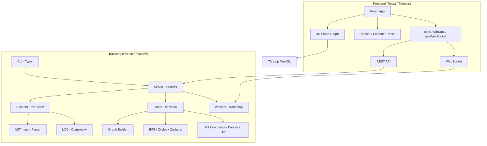
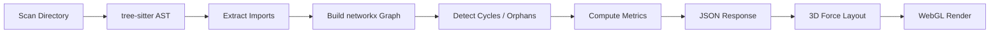
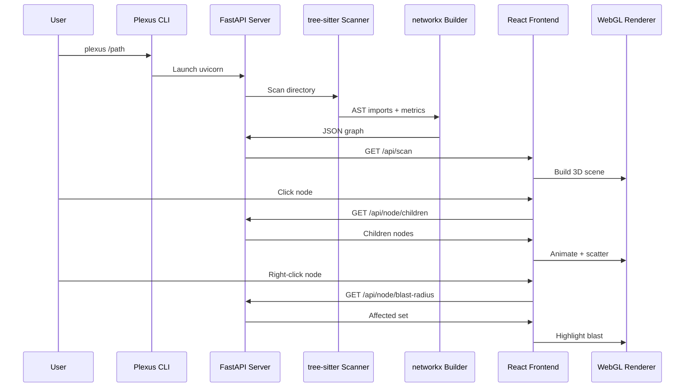
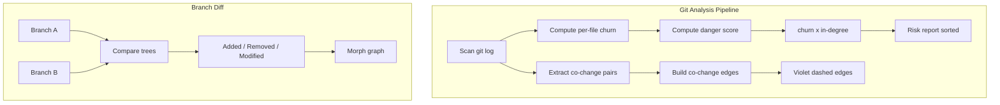

██████╗ ██╗     ███████╗██╗  ██╗██╗   ██╗███████╗
██╔══██╗██║     ██╔════╝╚██╗██╔╝██║   ██║██╔════╝
██████╔╝██║     █████╗   ╚███╔╝ ██║   ██║███████╗
██╔═══╝ ██║     ██╔══╝   ██╔██╗ ██║   ██║╚════██║
██║     ███████╗███████╗██╔╝ ██╗╚██████╔╝███████║
╚═╝     ╚══════╝╚══════╝╚═╝  ╚═╝ ╚═════╝ ╚══════╝

  Explore your codebase in 3D — live dependency graph, built-in analysis

[](https://python.org)
[](https://typescriptlang.org)
[](https://fastapi.tiangolo.com)
[](https://react.dev)
[](https://docs.astral.sh/uv)
[](LICENSE)
[](https://github.com/anomalyco/plexus/pulls)

---

> **Plexus** is a 3D interactive codebase visualizer. It scans your project, parses imports using tree-sitter, builds a dependency graph, and renders it as an immersive WebGL force graph. Click, fly, filter — understand your architecture from orbit.

---

## Architecture





---

## Quick Install

```bash
git clone https://github.com/anomalyco/plexus.git && cd plexus
make install          # or: python3 install.py

# Run from anywhere:
plexus /path/to/project    # Interactive 3D mode
plexus --json-pretty .     # CLI-only JSON mode
plexus --help              # All options
```

---

## How This Is Different

| | Plexus | Dependency Cruiser | CodeSee | Sourcegraph |
|---|---|---|---|---|
| **Rendering** | 3D WebGL force graph | Static SVG | 2D zoomable | Web-based IDE |
| **Install** | `uv tool install` (one command) | npm global | SaaS + browser extension | SaaS / Docker |
| **Local-first** | ✅ Fully offline | ✅ Offline | ❌ Cloud required | ❌ Cloud required |
| **Live file watching** | ✅ WebSocket live updates | ❌ Manual re-run | ❌ | ❌ |
| **Git integration** | Co-change, danger score, branch diff | ❌ | ✅ (limited) | ✅ |
| **Blast radius** | Right-click reverse BFS | ❌ | ❌ | ❌ |
| **Path tracing** | Interactive shortest-path between files | ✅ | ❌ | ❌ |
| **Circular deps** | Visual + panel + glow | ✅ | ✅ | ❌ |
| **Orphan detection** | Amber ring + filter | ❌ | ❌ | ❌ |
| **Health overlay** | Complexity gradient (green→amber→red) | ❌ | ❌ | ❌ |
| **Focus mode** | Double-click isolate + neighbors | ❌ | ❌ | ❌ |
| **Depth ring layout** | Concentric rings by distance from root | ❌ | ❌ | ❌ |
| **Snapshots** | Export/import view state as JSON | ❌ | ❌ | ❌ |
| **Self-contained** | Single CLI binary (via uv) | npm dep | Browser ext | Server |

---

## Features

### Core

- **3D Force Graph** — Navigate your codebase as an interactive WebGL node graph. Rotate, pan, zoom. Built on 3d-force-graph + Three.js.
- **Progressive Node Expansion** — Click directories to expand children. The force simulation scatters them into place.
- **Live File Watcher** — File changes trigger real-time graph updates via WebSocket. Nodes appear/disappear/morph as you edit.

### Analysis

- **Blast Radius** — Right-click any node to see its entire reverse dependency chain. Affected nodes highlight, edges glow blue.
- **Path Tracer** — Press `P`, click two files — the shortest dependency path is traced with a looping particle signal.
- **Circular Dependency Detection** — Auto-flagged cycles with red glow, pulsing edges, and dedicated panel.
- **Dead Code / Orphan Detection** — Files with zero inbound imports get an amber rotating ring. Filter to view orphans only.
- **Code Health Overlay** — Press `H` to switch from file-type colors to a complexity gradient (green → amber → red). Node size scales with LOC.

### Git Integration

- **Co-Change Clustering** — Violet edges between files that frequently change together in git history.
- **Stranger Danger Score** — High-risk files ranked by churn × in-degree. Sortable risk report panel.
- **Branch Diff Mode** — Compare two branches. The graph morphs to show added (green), removed (red), and modified (amber) nodes.

### UI

- **Camera Fly-To Search** — `Cmd/Ctrl+K` opens a command palette. Search files by name, camera flies to the node.
- **Focus Mode** — Double-click a node to isolate it and its immediate dependencies. Everything else dims.
- **Depth Ring Layout** — Toggle concentric ring arrangement sorted by distance from root directory.
- **Minimap** — 2D overhead view of the full graph with viewport indicator. Draggable.
- **Filter Sidebar** — Toggle file types, orphans, cycles, complexity threshold. Press `F`.
- **Node Detail Panel** — Click any file for LOC, complexity, maintainability, danger score, git churn, dependencies, code preview.
- **Scan Modal** — First-launch experience with path input and animated entry.

### Other

- **Shareable Snapshots** — Export/import the current view (filters, mode, camera) as a JSON file.
- **JSON CLI Mode** — `plexus --json .` for CI pipelines and scripting.
- **Config File** — `.plexusrc` for ignore patterns, entry points, thresholds.

---

## Usage

### Interactive mode (starts server + opens browser)

```bash
plexus /path/to/project    # Visualize a specific directory
plexus .                   # Visualize current directory
```

### JSON mode (CLI only, no server)

```bash
plexus --json /path/to/project       # Print analysis as JSON
plexus --json-pretty .               # Pretty-printed JSON
```

### Options

| Flag | Description |
|------|-------------|
| `--port`, `-p` | Custom server port (default: random available) |
| `--json` | Print graph analysis as JSON and exit |
| `--json-pretty` | Pretty-printed JSON output |
| `--version` | Show version |

---

## Keyboard Shortcuts

| Shortcut | Action |
|----------|--------|
| `Cmd/Ctrl + K` | Open search command palette |
| `Escape` | Exit any active mode / close panels |
| `B` | Toggle blast radius on selected node |
| `P` | Enter path trace mode |
| `F` | Toggle filter sidebar |
| `H` | Toggle health overlay |
| `R` | Reset camera to root node |
| `Space` | Pause / resume force simulation |
| `Double-click` | Enter focus mode on node |
| `Right-click` | Enter blast radius on node |

---

## Development

### Prerequisites

- Python 3.11+
- [uv](https://docs.astral.sh/uv/) (package manager)
- Node.js 18+ (for frontend dev)

### Setup

```bash
# Backend
cd backend
uv sync
uv run uvicorn plexus.server:app --reload --port 8000

# Frontend (separate terminal)
cd frontend
npm install
npm run dev        # Vite on port 5173, proxies /api and /ws to :8000
```

### One-command dev launcher

```bash
./scripts/dev.sh
```

Starts both backend (`:8000`) and frontend (`:5173`) concurrently.

---

## API Reference

| Method | Route | Description |
|--------|-------|-------------|
| `POST` | `/api/scan` | Scan a directory, return full graph |
| `GET` | `/api/node/children?node_id=` | Get children of a directory node |
| `GET` | `/api/node/blast-radius?node_id=` | Compute blast radius set |
| `GET` | `/api/path?from_id=&to_id=` | Shortest dependency path |
| `GET` | `/api/layout/depth-rings` | Depth ring positions (BFS from root) |
| `GET` | `/api/git/branches` | List git branches |
| `POST` | `/api/diff` | Graph diff between two branches |
| `GET` | `/api/file-content?path=` | Read file content (first 2000 chars) |
| `GET` | `/api/health` | Backend health check |
| `WS` | `/ws` | Live file watcher event stream |

---

## Configuration

Place a `.plexusrc` in the scanned directory root:

```json
{
  "ignore": ["node_modules", ".git", "dist", "build", "__pycache__", ".venv"],
  "entry_points": ["index.js", "main.py", "app.jsx", "src/index.tsx"],
  "cochange_threshold": 5,
  "danger_score_threshold": 60,
  "languages": ["python", "javascript", "typescript"]
}
```

Falls back to sensible defaults (`.plexusrc.defaults`) if no config file is found.

---

## Project Structure

```
plexus/
├── install.py                  # Cross-platform installer
├── Makefile                    # Convenience: make install
├── pyproject.toml              # Python package config
├── .plexusrc.defaults          # Default config
├── scripts/dev.sh              # Dev launcher
├── backend/
│   └── plexus/
│       ├── cli.py              # Typer CLI entrypoint
│       ├── server.py           # FastAPI app + routes
│       ├── config.py           # .plexusrc loader
│       ├── scanner/
│       │   ├── directory.py    # Directory traversal
│       │   ├── parser.py       # AST import extraction
│       │   └── metrics.py      # LOC, complexity
│       ├── graph/
│       │   ├── builder.py      # networkx graph construction
│       │   ├── algorithms.py   # BFS, cycles, orphans
│       │   └── git_analysis.py # Co-change, danger score, diff
│       ├── watcher/
│       │   └── live.py         # watchdog file watcher
│       └── static/             # Built frontend assets
├── frontend/
│   ├── index.html
│   ├── package.json
│   ├── vite.config.ts
│   └── src/
│       ├── main.tsx
│       ├── App.tsx             # Root component + state
│       ├── globals.css         # Design tokens (CSS custom props)
│       ├── components/
│       │   ├── Graph3D.tsx     # 3D force graph wrapper
│       │   ├── Toolbar.tsx     # Top toolbar with modes
│       │   ├── Sidebar.tsx     # Filter panel
│       │   ├── NodePanel.tsx   # File detail slide-in
│       │   ├── SearchBar.tsx   # Command palette
│       │   ├── MiniMap.tsx     # 2D overhead minimap
│       │   ├── HUD.tsx         # Status overlays
│       │   ├── ScanModal.tsx   # Entry state modal
│       │   └── Toast.tsx       # Notification toasts
│       ├── hooks/
│       │   ├── useGraphData.ts
│       │   ├── useWebSocket.ts
│       │   ├── useCamera.ts
│       │   └── useGraph.ts
│       └── utils/
│           ├── colors.ts
│           ├── layout.ts
│           └── graphUtils.ts
└── README.md
```

---

## Tech Stack

| Layer | Technology |
|-------|-----------|
| Backend | Python 3.11+ / FastAPI / networkx / tree-sitter / watchdog / gitpython |
| Frontend | React 18 + Vite / TypeScript / 3d-force-graph / Three.js / @tweenjs/tween.js / Lucide / React Bits |
| CLI | Typer |
| Packaging | uv / hatchling |
| Install | `uv tool install` or `pip install` |
| Design | Google Stitch / CSS Modules / Inter + JetBrains Mono |

---

## Data Flow



---

## Git Workflow



---